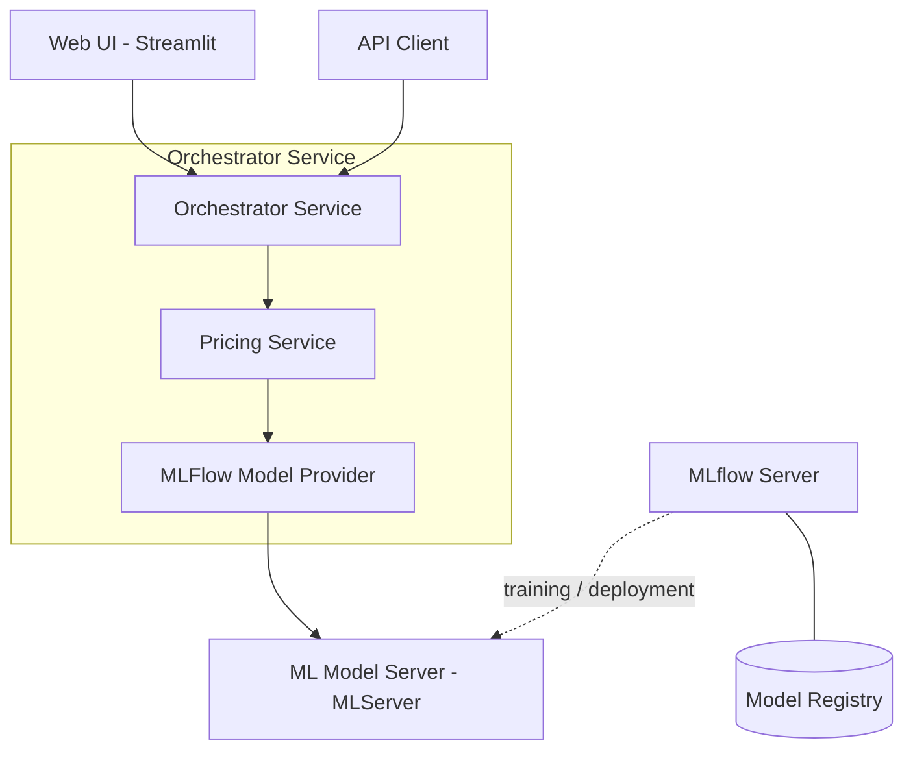

# modern-ml-microservices

Example repository of how to build a modern microservice architecture to support machine learning applications.

## Overview

This project demonstrates a production-style ML microservice architecture using a housing price regression model built on the [Ames Housing dataset](https://www.kaggle.com/c/house-prices-advanced-regression-techniques).



### Services

| Service | Port | Description |
|---------|------|-------------|
| **housing-price-ui** | 8501 | Streamlit web application for interactive housing price predictions |
| **housing-price-orchestrator** | 8000 | FastAPI REST API that receives prediction requests and orchestrates calls to the model |
| **housing-price-model** | 8080 | MLflow model server serving a trained scikit-learn regression model via MLServer |
| **mlflow-server** | — | MLflow tracking server and model registry for experiment tracking and model versioning |

## Prerequisites

- **Python 3.13+**
- **[uv](https://github.com/astral-sh/uv)** — for dependency management
- **[just](https://just.systems/)** — for task running
- **Docker & Docker Compose** — for running services

## Quick Start

```bash
# Install dependencies
just install

# Start all services
just up

# Tear down services
just down
```

Once running, the services are available at:

- **Web UI:** `http://localhost:8501`
- **Orchestrator API:** `http://localhost:8000`

## API Usage

### Single Prediction

```bash
curl -X POST http://localhost:8000/api/v1/price/predict \
  -H "Content-Type: application/json" \
  -d '{
    "id": 1,
    "ms_sub_class": 20,
    "ms_zoning": "RL",
    "lot_area": 8450,
    "street": "Pave",
    "lot_shape": "Reg",
    "land_contour": "Lvl",
    "utilities": "AllPub",
    "lot_config": "Inside",
    "land_slope": "Gtl",
    "neighborhood": "CollgCr",
    "condition_1": "Norm",
    "condition_2": "Norm",
    "bldg_type": "1Fam",
    "house_style": "2Story",
    "overall_qual": 7,
    "overall_cond": 5,
    "year_built": 2003,
    "year_remod_add": 2003,
    "roof_style": "Gable",
    "roof_matl": "CompShg",
    "exterior_1st": "VinylSd",
    "exterior_2nd": "VinylSd",
    "exter_qual": "Gd",
    "exter_cond": "TA",
    "foundation": "PConc",
    "bsmt_fin_sf_1": 706,
    "bsmt_fin_sf_2": 0,
    "bsmt_unf_sf": 150,
    "total_bsmt_sf": 856,
    "heating": "GasA",
    "heating_qc": "Ex",
    "central_air": "Y",
    "first_flr_sf": 856,
    "second_flr_sf": 854,
    "low_qual_fin_sf": 0,
    "gr_liv_area": 1710,
    "bsmt_full_bath": 1,
    "bsmt_half_bath": 0,
    "full_bath": 2,
    "half_bath": 1,
    "bedroom_abv_gr": 3,
    "kitchen_abv_gr": 1,
    "kitchen_qual": "Gd",
    "tot_rms_abv_grd": 8,
    "functional": "Typ",
    "fireplaces": 0,
    "garage_cars": 2,
    "garage_area": 548,
    "paved_drive": "Y",
    "wood_deck_sf": 0,
    "open_porch_sf": 61,
    "enclosed_porch": 0,
    "three_ssn_porch": 0,
    "screen_porch": 0,
    "pool_area": 0,
    "misc_val": 0,
    "mo_sold": 2,
    "yr_sold": 2008,
    "sale_type": "WD",
    "sale_condition": "Normal"
  }'
```

**Response:**
```json
{
  "id": 1,
  "predictedPrice": 185432.50
}
```

### Batch Prediction

```bash
curl -X POST http://localhost:8000/api/v1/price/predict/batch \
  -H "Content-Type: application/json" \
  -d '{"data": [ <request_1>, <request_2>, ... ]}'
```

## Development

All development commands are managed via [`just`](https://just.systems/). Run `just --list` for the full command reference.

| Command | Description |
|---------|-------------|
| `just install` | Install dependencies with `uv sync` |
| `just up` | Start Docker services and attach to logs |
| `just down` | Tear down Docker services |
| `just test` | Run unit and integration tests |
| `just test-cov` | Run tests with coverage report |
| `just lint` | Run `ruff` linting |
| `just format` | Format code with `ruff` |
| `just check` | Full CI gate (lint, format, test, pre-commit) |
| `just clean-all` | Remove build artifacts, Docker state, and venv |

### Project Structure

```
modern-ml-microservices/
├── compose.yaml                      # Docker Compose orchestration
├── justfile                          # Task runner commands
├── pyproject.toml                    # Root workspace configuration
├── housing-price-ui/                 # Streamlit web UI service
│   ├── src/
│   │   ├── main.py                   # Streamlit entry point
│   │   ├── ui/                       # Streamlit app components
│   │   ├── client/                   # HTTP client for orchestrator API
│   │   ├── config/                   # UI configuration and settings
│   │   └── models/                   # Pydantic request/response models
│   ├── samples/                      # Sample data for UI exploration
│   └── tests/
│       └── unit/                     # Unit tests
├── housing-price-orchestrator/       # FastAPI orchestrator service
│   ├── src/
│   │   ├── main.py                   # FastAPI app and endpoints
│   │   ├── service/                  # Business logic layer
│   │   ├── provider/                 # Data access layer (MLflow client)
│   │   └── shared/                   # Config, DTOs, request/response views
│   └── tests/
│       ├── unit/                     # Unit tests
│       └── integration/              # Integration tests
├── housing-price-model/              # Trained ML model and serving Dockerfile
│   ├── build/                        # Model artifacts and Docker image
│   ├── data/                         # Training dataset
│   ├── deployment/                   # Model build scripts
│   └── notebooks/                    # Jupyter training notebooks
└── mlflow-server/                    # MLflow tracking and model registry
    └── mlruns/                       # Experiment runs and model versions
```

## Tech Stack

- **Python 3.13+** with **[uv](https://github.com/astral-sh/uv)** for package management
- **[Streamlit](https://streamlit.io/)** for the web UI
- **[FastAPI](https://fastapi.tiangolo.com/)** for the REST API
- **[Pydantic](https://docs.pydantic.dev/)** for data validation and settings
- **[httpx](https://www.python-httpx.org/)** for HTTP client communication
- **[MLflow](https://mlflow.org/) + MLServer** for model serving and tracking
- **[scikit-learn](https://scikit-learn.org/)** for the regression model
- **[Ruff](https://docs.astral.sh/ruff/)** for linting and formatting
- **[pytest](https://docs.pytest.org/)** for testing
- **[Docker Compose](https://docs.docker.com/compose/)** for local orchestration

## Blog Series

The [main](https://github.com/DataDelver/modern-ml-microservices) branch of this repo will always show the latest version, with each part contained on its own branch.

| Post | Branch |
|------|--------|
| [Delve 6: Let's Build a Modern ML Microservice Application - Part 1](https://www.datadelver.com/software%20engineering/2025/01/26/ml-micro-part-one.html) | [part-one](https://github.com/DataDelver/modern-ml-microservices/tree/part-one) |
| [Delve 7: Let's Build a Modern ML Microservice Application - Part 2, The Data Layer](https://www.datadelver.com/software%20engineering/2025/02/05/ml-micro-part-two.html) | [part-two](https://github.com/DataDelver/modern-ml-microservices/tree/part-two) |
| [Delve 8: Let's Build a Modern ML Microservice Application - Part 3, The Business Logic and Interface Layers](https://www.datadelver.com/software%20engineering/2025/02/16/ml-micro-part-three.html) | [part-three](https://github.com/DataDelver/modern-ml-microservices/tree/part-three) |
| [Delve 10: Let's Build a Modern ML Microservice Application - Part 4, Configuration](https://www.datadelver.com/2025/03/25/delve-10-lets-build-a-modern-ml-microservice-application---part-4-configuration.html) | [part-four](https://github.com/DataDelver/modern-ml-microservices/tree/part-four) |
| [Delve 11: Let's Build a Modern ML Microservice Application - Part 5, Testing](https://www.datadelver.com/2025/04/13/delve-11-lets-build-a-modern-ml-microservice-application---part-5-testing.html) | [part-five](https://github.com/DataDelver/modern-ml-microservices/tree/part-five) |
| [Delve 12: Let's Build a Modern ML Microservice Application - Part 6, Containerization](https://www.datadelver.com/2025/05/03/delve-12-lets-build-a-modern-ml-microservice-application---part-6-containerization.html) | [part-six](https://github.com/DataDelver/modern-ml-microservices/tree/part-six) |
| [Delve 13: Let's Build a Modern ML Microservice Application - Part 7, Model Tracking and APIs with MLFlow](https://www.datadelver.com/2025/06/01/delve-13-lets-build-a-modern-ml-microservice-application---part-7-model-tracking-and-apis-with-mlflow.html) | [part-seven](https://github.com/DataDelver/modern-ml-microservices/tree/part-seven) |
| [Delve 15: Let's Build a Modern ML Microservice Application - Part 8, The Orchestrator Service](https://www.datadelver.com/2025/08/17/delve-15-lets-build-a-modern-ml-microservice-application---part-8-the-orchestrator-service.html) | [part-eight](https://github.com/DataDelver/modern-ml-microservices/tree/part-eight) |
| [Delve 19: Let's Build a Modern ML Microservice Application - Part 9, Docker Container Optimization](https://www.datadelver.com/2025/12/07/delve-19-lets-build-a-modern-ml-microservice-application---part-9-docker-container-optimization.html) | [part-nine](https://github.com/DataDelver/modern-ml-microservices/tree/part-nine) |
| [Delve 23: Let's Build a Modern ML Microservice Application - Part 10, Improving DevX with AI](https://www.datadelver.com/2026/07/11/delve-23-lets-build-a-modern-ml-microservice-application---part-10-improving-devx-with-ai.html) | [part-ten](https://github.com/DataDelver/modern-ml-microservices/tree/part-ten) |
